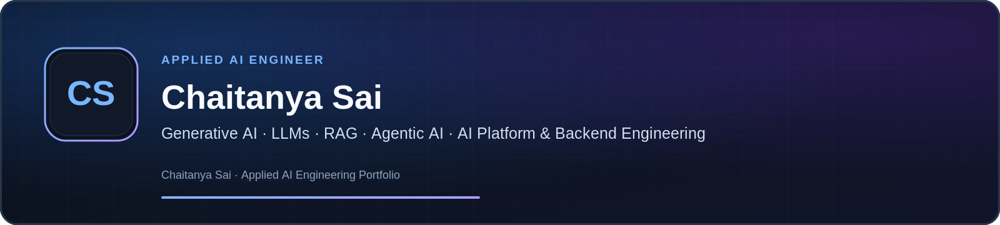

# Chaitanya Sai

### Applied AI Engineer | Generative AI · LLM Applications · Agentic AI · RAG · AI Platform & Backend · AI Product Engineering

I build **production-oriented Applied AI systems** across agentic orchestration, RAG and retrieval, AI backends, full-stack AI products, evaluation, governance, observability, reliability, and regulated software.

My engineering approach keeps **model output bounded by deterministic application state, authorization, evidence, validation, and recovery controls** rather than treating an LLM as the system of record.

---

## Engineering Focus

- **Agentic AI & Orchestration** — LangGraph typed-state workflows, multi-agent routing, human approvals, policy gates, MCP tool/context integration, checkpointing, rollback and recovery
- **Retrieval & RAG** — BM25 + PostgreSQL/pgvector hybrid retrieval, HNSW/IVFFlat, query rewriting, metadata filtering, caching, reranking, citations and retrieval evaluation
- **AI Platform & Backend** — Python, async FastAPI, Pydantic, SSE/WebSockets, PostgreSQL, Redis, Kafka, service boundaries and asynchronous execution
- **LLM Runtime** — LiteLLM routing across hosted and local providers, model/provider failover, token/cost tracing and structured outputs
- **Identity, Security & Governance** — OAuth2/OIDC/JWT, RBAC, SSO-ready patterns, AWS IAM/Secrets Manager, human-in-the-loop controls, PII protection and audit lineage
- **Observability & Delivery** — Langfuse, OpenTelemetry, CloudWatch, Docker, Kubernetes, Helm, Terraform, GitHub Actions and CI/CD
- **Regulated Systems** — pharmaceutical software, GxP, 21 CFR Part 11, ALCOA+, QMS, CAPA, deviations, change control and traceability

---

## Verified Engineering Signals

| Area | Evidence |
|---|---|
| **Agentic AI** | **94.8% task completion** across evaluation suites · **3,950+ passing regression tests** in the broader implementation |
| **RAG / Retrieval** | **91.4% Recall@10 · 0.86 MRR · 0.89 NDCG** |
| **Retrieval performance** | **140 ms P50 retrieval · <420 ms P95 end-to-end** |
| **PharmaAI corpus** | **1,000+ pages · 200 openFDA validation records** |
| **Public engineering evidence** | **66 automated tests across six public showcases with GitHub Actions CI** |
| **Job Copilot** | **11-entity relational source-of-truth model · 19 Vitest cases across 7 files** |

---

## Flagship Engineering

### [Agentic AI Platform](https://github.com/chaitanyaAI-careers/Agentic-ai-platform)

**Public showcase:** role routing, approval/risk controls, controlled execution boundaries, provider abstraction, deterministic evaluation, automated tests and CI.

**Verified broader implementation:** LangGraph TypedDict state graphs across Planner/Coder/Reviewer/Tester roles, conditional routing, durable checkpoints, interrupt-based approvals, sandboxed MCP execution, PostgreSQL workflow state, LiteLLM routing, Redis/Kafka asynchronous runtime, OAuth2/OIDC/JWT, Langfuse/OpenTelemetry, Terraform, Kubernetes/Helm and AWS operational controls.

**Measured signal:** 94.8% task completion with 3,950+ passing regression tests.

### [Pharma AI Platform](https://github.com/chaitanyaAI-careers/Pharma-ai-platform)

**Public showcase:** retrieval-evidence contracts, stable citation identity, grounded-output contracts, structured summaries, traceability, human-review transitions, automated tests and CI.

**Verified broader implementation:** BM25 + PostgreSQL/pgvector hybrid retrieval, HNSW/IVFFlat indexing, query rewriting, metadata filtering, Redis caching, reranking, Bedrock-backed generation, Pydantic structured outputs, human review and Langfuse/OpenTelemetry traces.

**Measured signal:** 91.4% Recall@10 · 0.86 MRR · 0.89 NDCG · 140 ms P50 retrieval · <420 ms P95 end-to-end across a 1,000+ page corpus and 200 openFDA validation records.

### [Job Copilot](https://github.com/chaitanyaAI-careers/Job-copilot)

**Public showcase:** governed ingestion, normalization, freshness classification, cross-source deduplication, deterministic matching, React examples, 19 Vitest cases and CI.

**Verified broader implementation:** Next.js/React product architecture, 11-entity PostgreSQL/Prisma source-of-truth model, pgvector semantic matching, Redis/Kafka event-driven ingestion, LiteLLM assistance, OAuth2/OIDC/JWT identity, FastAPI services and Vercel/AWS delivery.

### [HR AI Content System](https://github.com/chaitanyaAI-careers/HR-ai-content-system)

Governed enterprise retrieval using SentenceTransformer embeddings, deterministic chunking and metadata, role-conditioned PII controls, grounded extractive answers, **17 tests**, a **21-question evaluation set**, and **10 policy areas**.

### [Medicine Verification Platform](https://github.com/chaitanyaAI-careers/Medicine-verification-platform)

FastAPI/Pydantic backend showcase with explicit API/service/repository boundaries, synthetic regulatory adapters, matched/not-found/ambiguous outcomes, health checks, automated tests and CI. Public scope remains intentionally limited and does not claim database-backed or live regulatory integrations.

### [Nudge](https://github.com/chaitanyaAI-careers/Nudge)

Workflow-reliability showcase with explicit PENDING/QUEUED/COMPLETED/FAILED states, queue eligibility, idempotency-key requirements, controlled transitions, structured delivery outcomes, automated tests and CI.

---

## Evidence Model

The public repositories are intentionally recruiter-safe showcases. I distinguish:

- **Public implementation** — code and tests directly inspectable in these repositories
- **Verified broader implementation** — implemented engineering maintained outside the smaller public showcases
- **In progress / platform direction** — capabilities not represented as completed until supported by reproducible evidence

This keeps the portfolio useful without overstating what is visible in any individual repository.

---

## Core Technologies

**AI / LLM:** Generative AI · LLM applications · LangGraph · MCP · LiteLLM · AWS Bedrock · Anthropic · OpenAI · Ollama · structured outputs

**Retrieval:** RAG · BM25 · PostgreSQL/pgvector · SentenceTransformers · HNSW · IVFFlat · metadata filtering · reranking · citations · retrieval evaluation

**Backend / Data:** Python · async FastAPI · Pydantic · PostgreSQL · SQLAlchemy · Prisma · Redis · Kafka · REST · SSE · WebSockets

**Security / Observability:** OAuth2 · OIDC · JWT · RBAC · AWS IAM · Secrets Manager · Langfuse · OpenTelemetry · CloudWatch

**Cloud / DevOps:** Docker · Kubernetes · Helm · Terraform · GitHub Actions · AWS · Vercel

**Product:** TypeScript · React · Next.js · full-stack AI workflows · deterministic policy + AI-assisted services

---

## Professional Direction

I target roles across:

**Applied AI Engineering · Agentic AI · Generative AI / LLM Applications · RAG / Retrieval · AI Platform & Backend Engineering · AI Product Engineering · AI Solutions / Forward-Deployed AI · AI Evaluation & Governance**

**Texas, USA · Open to Remote, Hybrid & Relocation**

---

## Connect

